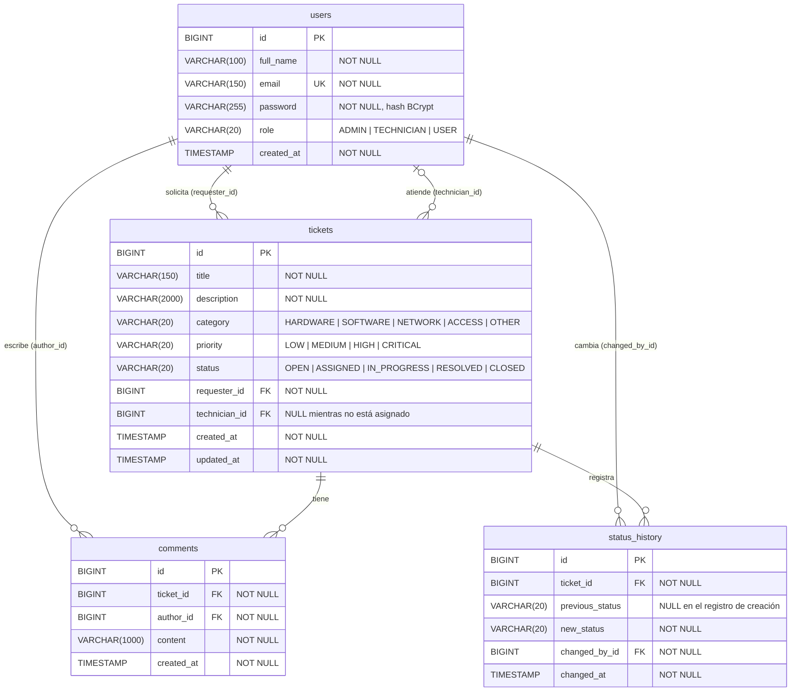

# Diagrama entidad-relación — CAMPUSDESK

> Dueño: Persona 4. Refleja `database/schema.sql` y las entidades del paquete `entity`; si cambia uno, se actualizan los tres.

## Notas

- `users` se llama así porque `user` es palabra reservada en PostgreSQL.
- Los enums se guardan como texto (`@Enumerated(EnumType.STRING)`) y la base los restringe con `CHECK`.
- Un ticket tiene dos relaciones con `users`: quien lo pide (obligatoria) y el técnico asignado (opcional).
- Al borrar un ticket se borran sus comentarios y su historial (`ON DELETE CASCADE`). La API no tiene endpoint para borrar tickets; es solo para limpiar datos de prueba.
- Índices: `tickets(requester_id)`, `tickets(technician_id)`, `tickets(status)`, `comments(ticket_id)`, `status_history(ticket_id)`.
